# The House

**A home-automation dashboard for a controller that has no public API.**
88 circuits across 7 rooms — lights, fans, curtain motors, air conditioners and a
projector — plus five televisions, an AV receiver and a media player that the hub
has never heard of and the dashboard drives directly. One page, on the LAN, no
cloud and no account.

The protocol was reverse-engineered by probing the hardware, because the vendor
publishes none. Everything below was measured against the real installation.

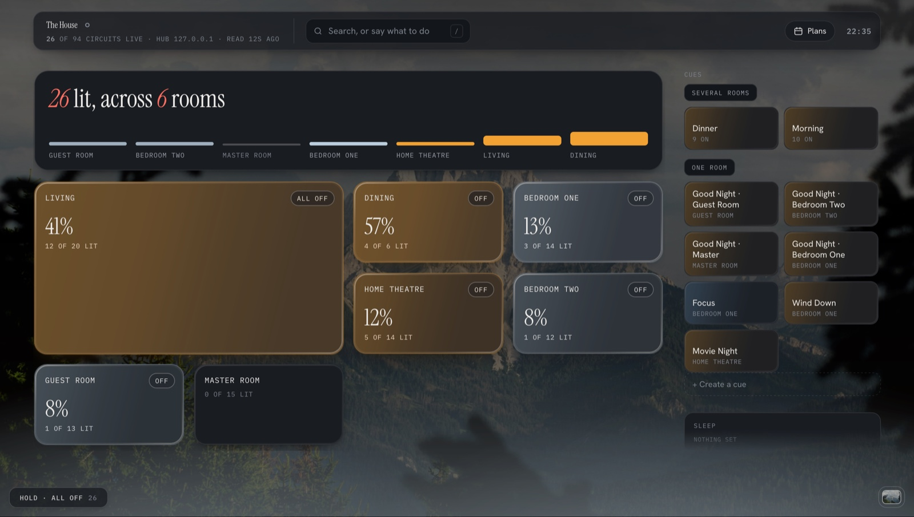

<sub>Screenshots are taken from a demo instance with generic room names — the
interface is the real one, the house it is pointed at is not.</sub>

---

## The board

The design has one claim: **the only colour on the page is the light the house is
making.** The chrome is neutral, and a lit circuit glows in its own measured
colour temperature — a lamp tuned to daylight reads blue, one at candle reads
amber, side by side. You can tell from across the room which rooms are warm.

<table>
<tr>
<td width="50%"></td>
<td width="50%">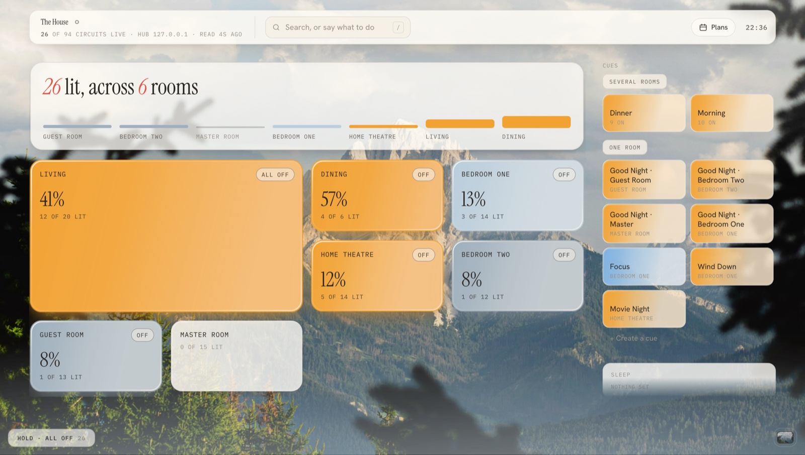</td>
</tr>
<tr>
<td><sub><b>After seven</b> — the pane stays dark and the light comes out of it.</sub></td>
<td><sub><b>Before seven</b> — a lit card is pigment instead. The theme follows
the <i>hub's</i> clock, not the phone's, so a device in another timezone still
shows the house as the house is.</sub></td>
</tr>
</table>

That is not one design inverted. A lit pane on paper is pale amber with dark ink;
inverted literally, that floods the card with bright amber and puts white text on
it — the worst contrast on the board at exactly the brightness you most want to
read. Every value that was chosen as a fraction of white had to be re-chosen, and
the numbers were measured rather than picked: the fill's leading stop gives
3.57:1 at 38% opacity and 4.95 at 24%, so it is 24%.

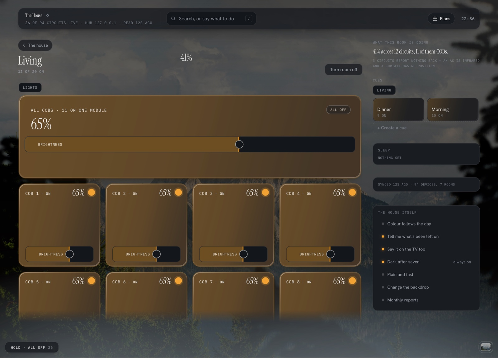

A room's ceiling is one control. Every room has COB 1…n — five in one room,
eleven in another — the same fitting repeated, nearly always wanted at one
setting. The group tile leads the section and the individual lamps stay below it.

Three things that tile does, each of which was a bug first:

- **The key means "make them all the same".** It used to switch off whenever
  *any* member was lit, so pressing it on a ceiling with one lamp on put that one
  out — the opposite of what a control called "all" appears to offer.
- **Its brightness reading averages only the lit members.** Four dark lamps and
  one at full is a ceiling set to 100 with most of it switched off, not a ceiling
  at 20%.
- **Colour needs 800 ms between commands and brightness does not.** One gap was
  applied to both, and colour was quietly changing a single lamp. Measured by eye,
  because the hub cannot be asked: at 60 ms, 1 of 5 lamps took the colour; at
  500 ms, 3 of 5; at 800 ms, 5 of 5, twice.

### On a phone

<table>
<tr>
<td width="50%">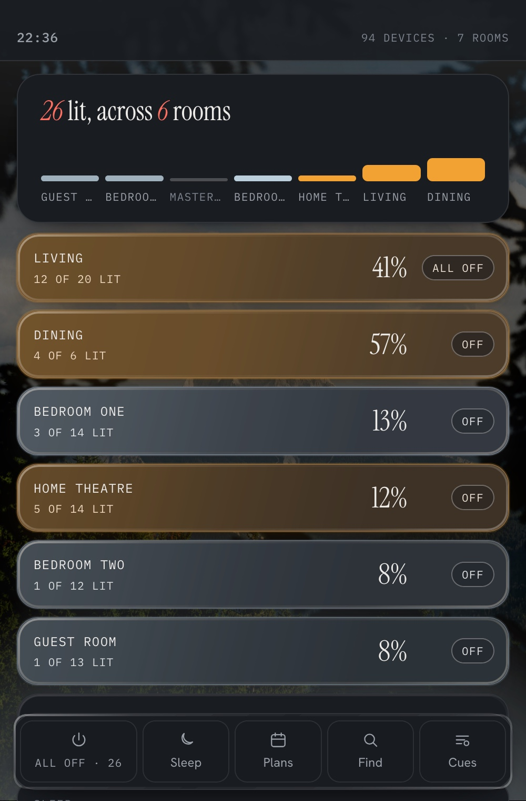</td>
<td width="50%">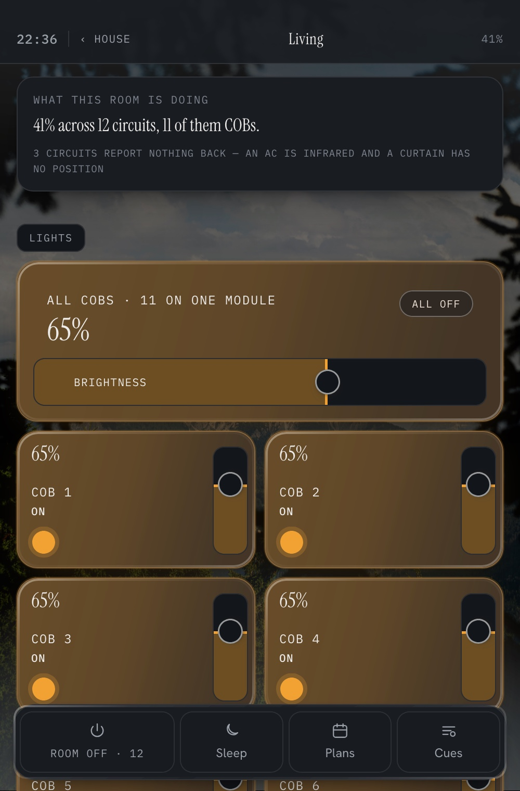</td>
</tr>
</table>

Read at a glance, steered by thumb. A card at the top carries the whole house —
what is lit said in words, over a row where every room is a column of its own
light, height for how much and colour for how warm. The three things done most
often live in a fixed bar at the bottom rather than at the top of a page you have
to reach across.

### Two halves that are never merged

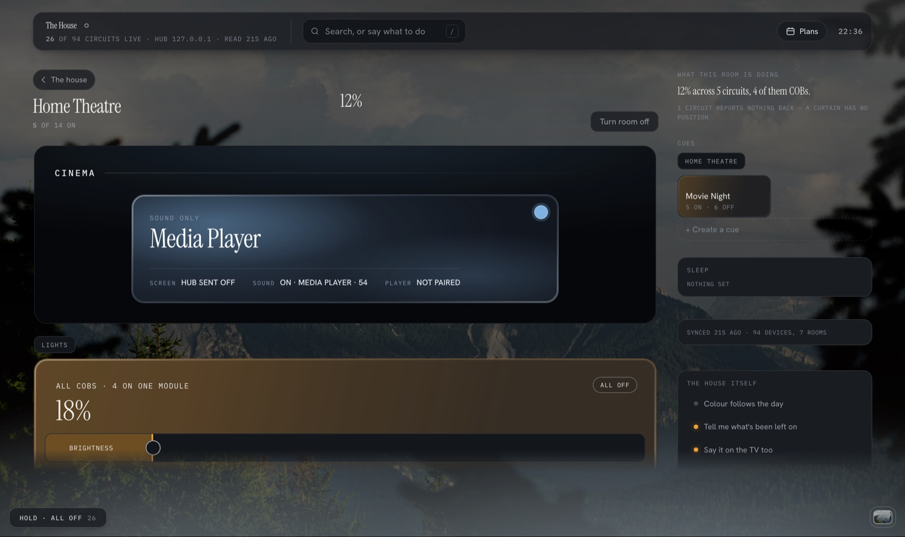

This is the design thesis in one card. The receiver states its volume and source
**as fact** — it reports itself, including whatever its own remote does. The
projector is infrared, which is one-way: the hub blasts a code and never hears
back, so its half can only say `HUB SENT OFF`. A single combined "ON" would
quietly promote a guess to a reading.

That distinction runs through the whole system. An IR device's state is a belief;
a television's is a reading. The interface is never allowed to blur them.

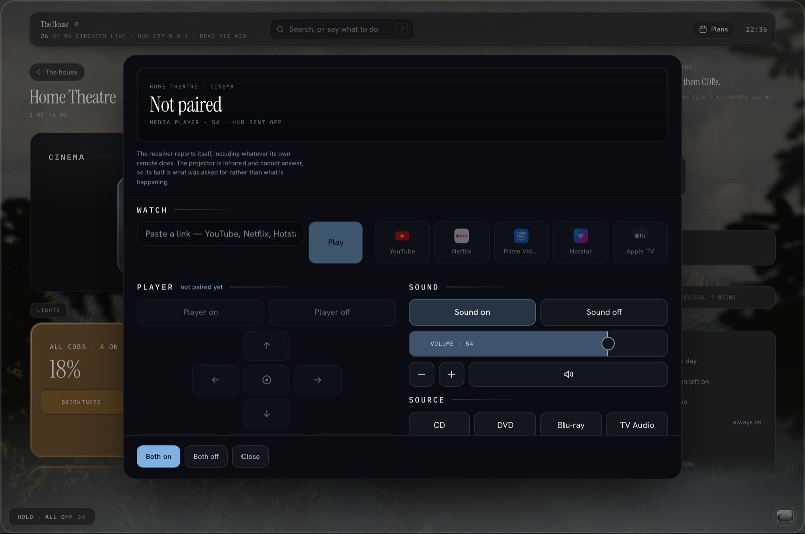

The source names are discovered from the receiver, never hard-coded — which is
why `GAME` shows up as **PS5**, a label no built-in table could know.

---

## Speaking to it

You hold a button on your phone, say something in Hinglish, and the house does it
and answers out loud.

```
"guest room ka fan chalu karo"  →  grammar    "Fan in Guest Room is now on."
"living cobs 40"                →  grammar    "The cobs in Living are now at 40%."
"living cobs down"              →  grammar    "The cobs in Living are now at 20%."
"cancel"                        →  cancel     "The cobs in Living are back as they were."
"good night"                    →  goodnight  "Good night, Guest. Sleep well."
```

<sub>Actual replies from a running instance. The middle column is the road the
sentence took — none of these five reached a model.</sub>

[**How the house listens →**](docs/how-the-house-listens.html) — the pipeline
written up end to end: the phone, the transcriber, the three gates, the free
grammar, the model, the guards, and the reply.

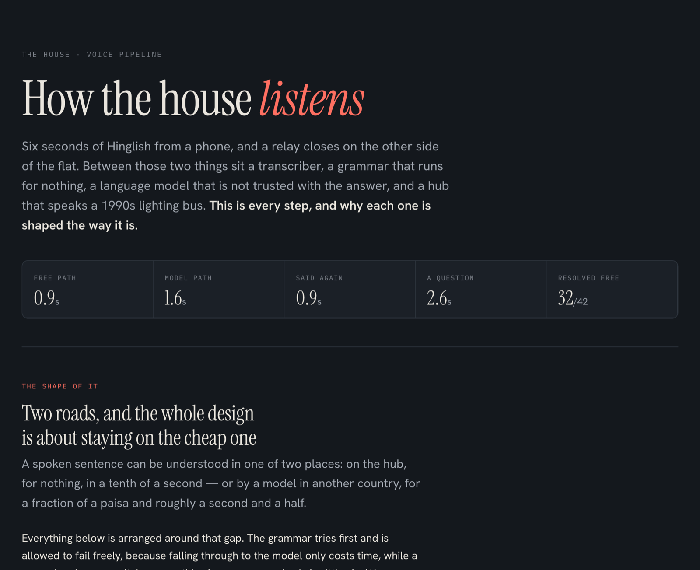

The whole design is about **staying off the model.** A sentence can be resolved on
the hub for nothing in a tenth of a second, or by a model for a fraction of a
paisa and a second and a half. A filler-stripping grammar tries first and is
allowed to fail freely; 32 of 42 test sentences never reach the model.

| | |
|---|---|
| resolved on the hub | **0.9 s** |
| via the model | **1.6 s** |
| said a second time | **0.9 s** |
| a question about the house | **2.6 s** |

Four things it does that are less obvious than they look:

- **A question is kept away from the grammar entirely.** Stripping filler turns
  *"is the fan on?"* into `[fan, on]` — an impeccable command. Asking whether the
  fan was on **switched it on.** The gate is deliberately generous, because the
  two mistakes are not comparable: a command mistaken for a question still gets
  answered correctly by the model, while a question mistaken for a command
  switches something on in a room somebody is sitting in.
- **The model never phrases the answer.** It only says *what to look at*; the
  reading comes from the house. It returns a room and a circuit which are then
  validated against the same matcher a mistyped URL hits, so a circuit the model
  invents is a refusal rather than a cheerful success.
- **The reply is reworded for a phone's voice.** No em dash (it reads as a pause
  of unguessable length); lower case for an acronym meant as a word (`COBs`
  arrives as "C O B s" otherwise) but upper case for `AC` and `TV`, which are
  wanted spelled; and a verb, because "Foot light in Bedroom One off" is a caption
  rather than a sentence.
- **The transcriber is told the house's own vocabulary**, which on-device
  dictation cannot be. Measured over five commands of accented Hinglish, word
  recall went from 4/30 cold to 25/30 with the room and circuit names supplied.

Model choice was benchmarked rather than assumed — 17 sentences, four runs each,
scored against the address each should resolve to. The nearest rival was 27%
cheaper and consistently misread Hinglish numerals (`aadhe` as "down" rather than
50), which is the competence this house actually needs.

### The family guide is generated, never written

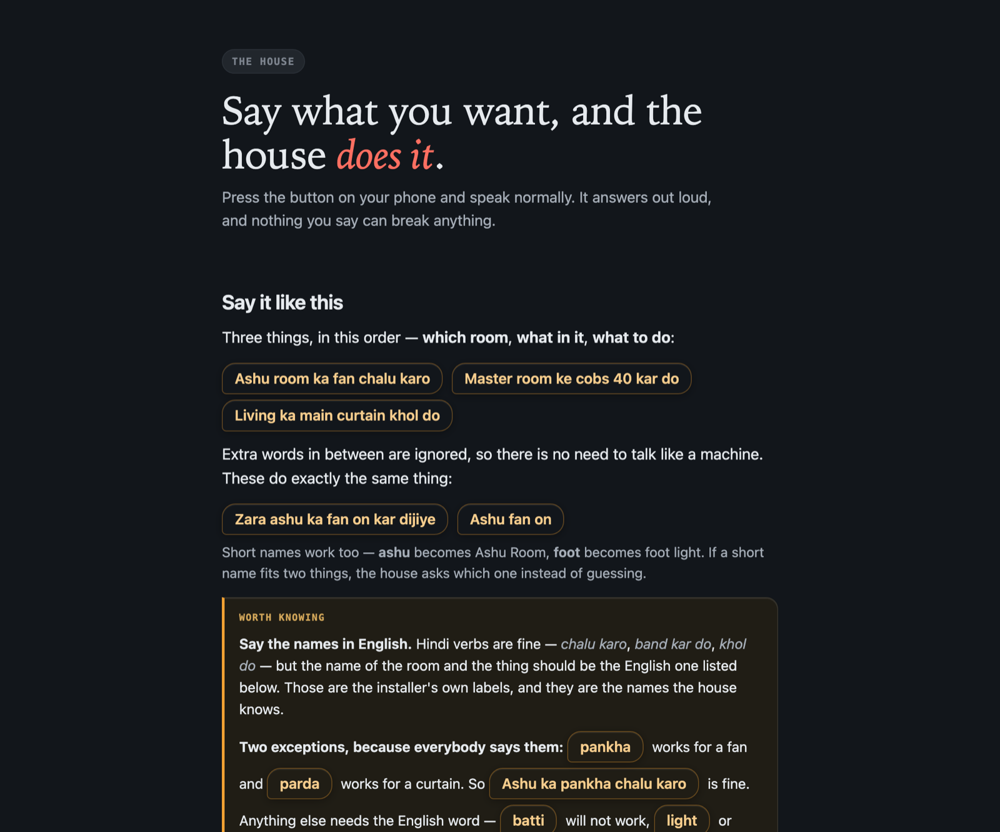

The people who live here needed to know what they can say. The page is built from
a **running server** rather than from a data file, because `/do/<room>` already
resolves what each circuit is and which verbs it accepts — a second derivation is
how a reference starts quietly lying.

The register follows the medium, which took a correction to get right: an
explanation is *read*, so it is in English; a phrase is *said*, so it is in the
Hinglish you would actually use; and a reply is spoken by a phone that cannot
pronounce Hinglish, so it is English again. Three media, three answers.

---

## Underneath

<table>
<tr>
<td width="50%">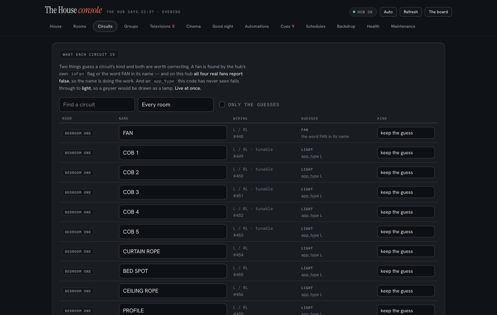</td>
<td width="50%">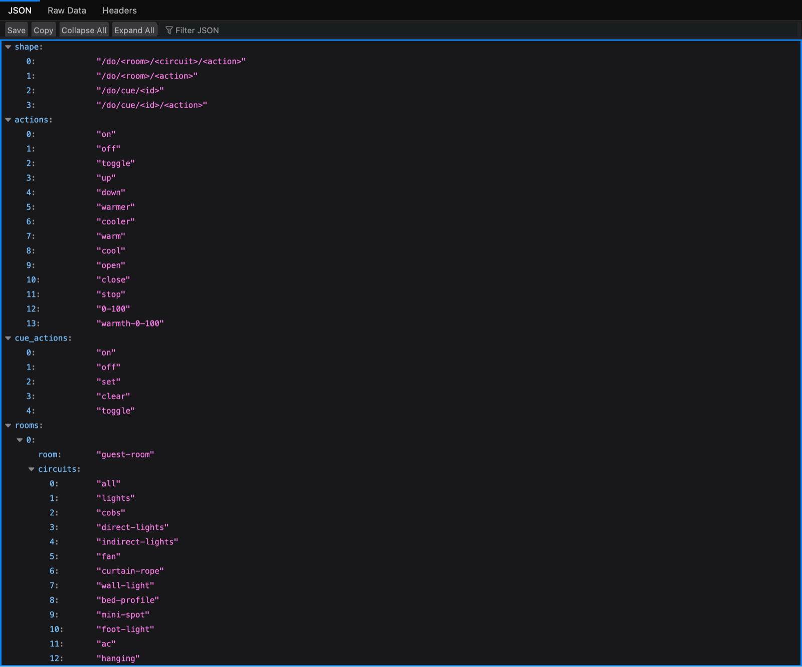</td>
</tr>
<tr>
<td><sub>A settings console — rooms, circuits, groups, screens, cues and
schedules, on its own page because a settings screen inside the thing being
configured is reachable by accident on a wall panel.</sub></td>
<td><sub><code>/do/&lt;room&gt;/&lt;circuit&gt;/&lt;action&gt;</code> — one
address grammar that Siri, cron and the dashboard's own command bar all go
through.</sub></td>
</tr>
</table>

Five protocols, none of them documented, all worked out against the hardware:

| | |
|---|---|
| **The hub** | WebSocket, one short-lived socket per command, the payload echoing the hub's own record. Send an `Origin` header and the handshake fails with an HTTP 500. |
| **The lighting bus** | HDL Buspro over UDP broadcast — `SMARTCLOUD` framing, CRC-16/CCITT, verified against a captured frame *before* transmitting, which is why it worked first time. |
| **Televisions** | LG webOS SSAP over `wss`. LG blacklists the public client certificate every open-source client sends; the same manifest with the signature block simply **left out** is accepted. |
| **AV receiver** | Denon telnet. A reply must wait for the *value*, not a fixed interval — a flat 500 ms settle had it reporting the previous input. |
| **Media player** | Android TV Remote v2 — TLS plus hand-rolled protobuf, because the box has debugging disabled and ADB is not available. |

**The recurring hazard is that this hardware reports success for things it did not
do.** Three examples, each of which looked fine from the dashboard:

- The step path **could not command an infrared air conditioner at all** and said
  it did. The hub then filed the status it was handed, so the board showed the
  unit off while it ran on. Proven by asking the hub's own journal what it tried:
  `Sending Operation on   on channel id` — no device, no channel.
- **Every fan speed on every infrared AC was going to low**, for one letter's
  case. The hub's dispatch falls through to `low` for anything it does not
  recognise, and the commands were being sent in lower case.
- **Setting a mode filed the unit as off.** Both forms reach a code, which is why
  the wrong one looked right for months — but the bare verb also writes
  `device_status`, so asking for *cool* recorded the machine as switched off while
  it carried on cooling.

`device_status_tunable` is the same trap: the hub writes the colour it was *told*
into its own database whether or not the lamp obeyed. A whole sweep of timings was
once run by reading that field back and produced a confident, wrong answer. **The
only instrument that works for colour is a person looking at the ceiling.**

---

## How this was built

**As of 30 August 2026: 216 commits in three weeks, 197 of them co-authored with
Claude Code.** The commit log says so on each one, and this section is here
because a README that implied otherwise would be contradicted by the repository
one click later.

What that means in practice is worth being precise about. The agent wrote most of
the code. What I did was the part a model in a datacentre cannot do:

- **Directed the reverse engineering.** Every protocol above came from deciding
  what to probe next — reading the vendor's own Python on the box rather than
  guessing payloads against a controller that answers nothing, and asking the
  hub's journal what it *tried* when our end could not tell success from silence.
- **Was the instrument.** Half of this system has no readable state. The fan-speed
  mapping was settled by standing in the room with the manufacturer's own remote
  and listening — after a plausible hypothesis about the installer's recording
  turned out to be wrong. Colour timings were counted by eye, condition by
  condition, interleaved so a burst of interference could not land on one of them.
- **Made the product calls, including the expensive ones.** A complete light
  theme was built and rejected. A complete Hinglish reply layer was built, tested
  on the phone, and removed when iOS could not pronounce it — the input stays
  Hinglish and the reply is English, and that asymmetry is the point. Thirty
  good-night lines were chosen from fifty-five candidates; what was rejected
  defines the register as sharply as what was kept.
- **Set the safety rules.** This runs in an occupied home. Tests are designed as
  no-ops — a fan already running, a room already dark, a curtain told to *stop*,
  which releases both relays and cannot move a motor. And the standing rule, written after a
  tidy-up restored a room to a reading two minutes old — which would have put out
  anything somebody had switched on in between: **undo only inside the same
  action; past that, report what you touched and leave it.**

[**`CLAUDE.md`**](CLAUDE.md) is the working log the whole thing was built against
— every measurement, every design decision, and every wrong turn kept with the
reasoning that produced it, because on this hardware the wrong turns are the
expensive knowledge. It is long on purpose.

---

## Running it

```bash
npm install
npm start                      # http://localhost:3000
```

```bash
PORT=3111 npm start            # a second instance, for testing
HUB_IP=192.0.2.1 npm start     # an unreachable hub, to exercise error paths
node --check server.js         # the only build step
```

No build, no framework, no bundler. `server.js` is the whole application — server
logic, then the entire frontend inside one HTML template literal. Two runtime
dependencies, `express` and `ws` — and `ws` is the single most fragile thing here,
because this hub's handshake fails *silently* when the client is wrong. It runs on
Node rather than Bun because the hub is a 2014 office desktop, and that model line
shipped with CPUs lacking the AVX2 that Bun's ordinary Linux build wants.

| | |
|---|---|
| [`SHORTCUTS.md`](SHORTCUTS.md) | Siri, Home Screen widgets, one-tap cues |
| [`deploy/`](deploy) | install, deploy-with-rollback, watchdog, fresh-install notes |
| [`tools/`](tools) | 19 standalone scripts — hub probes, the webOS and Android TV clients, the icon and lens generators, and the offline test harnesses for the voice grammar |
| [`docs/prompts.md`](docs/prompts.md) | exactly what is sent to the models, dumped from the running server rather than written by hand |

**Working against it changes something in someone's home.** Read the hub-protocol
section of `CLAUDE.md` before changing how commands are sent, check the hour, and
put back what you touch.
